# markethub-public

An app build on flutter and Dart for trading commodities such as Metals non Metals, Alloys and Energy Ores.

It Includes features such as 
    1. Daily market update notifications
    2. Instant alerts for users
    3. Market Related news
    4. Historic data for all commodities with graphs and many other features coming soon

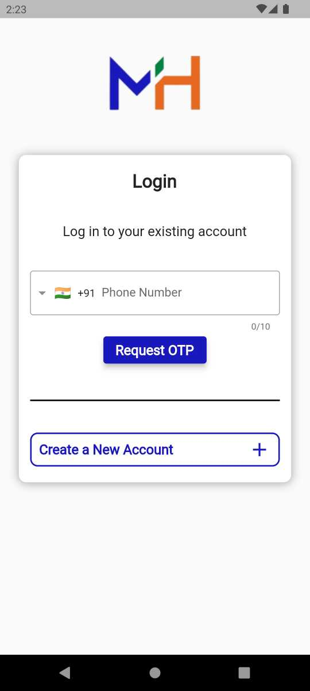
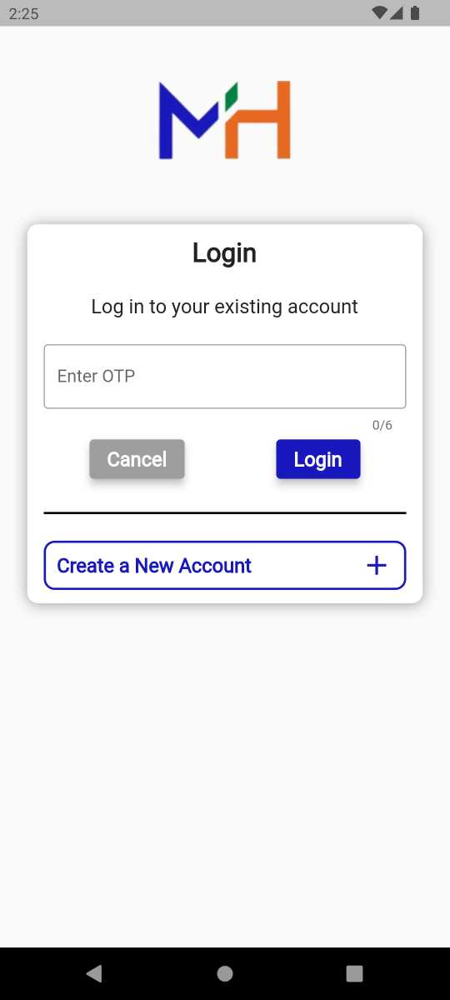
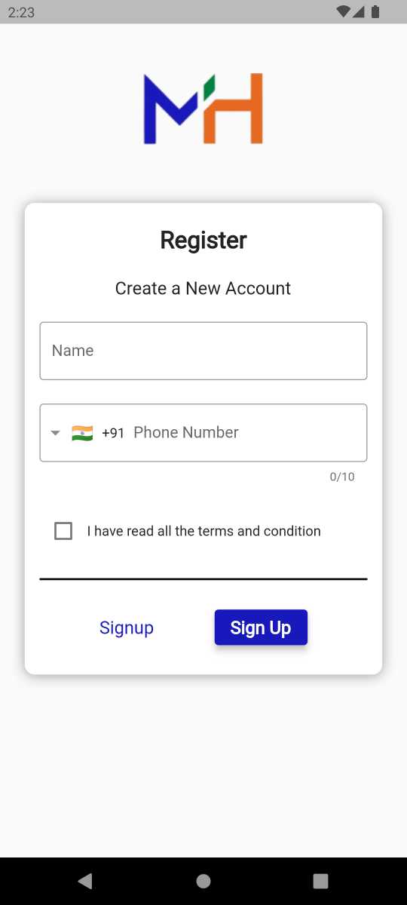
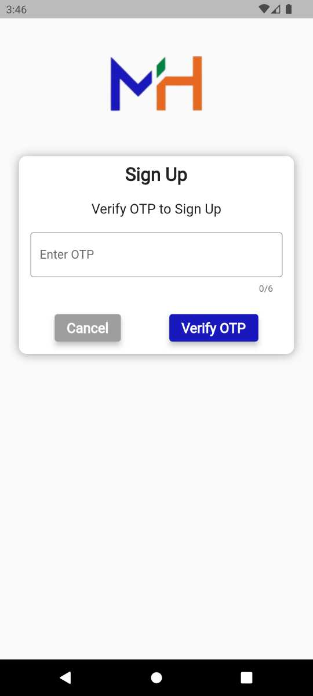
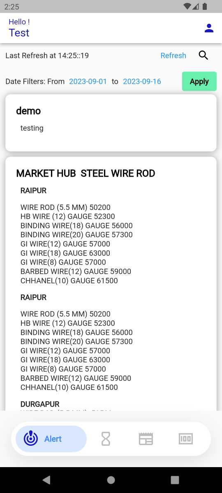
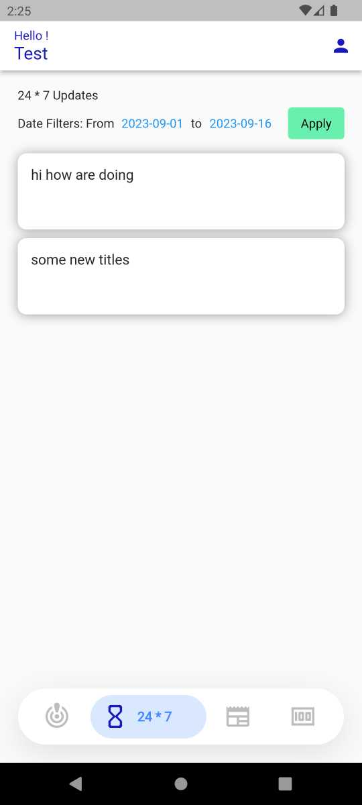
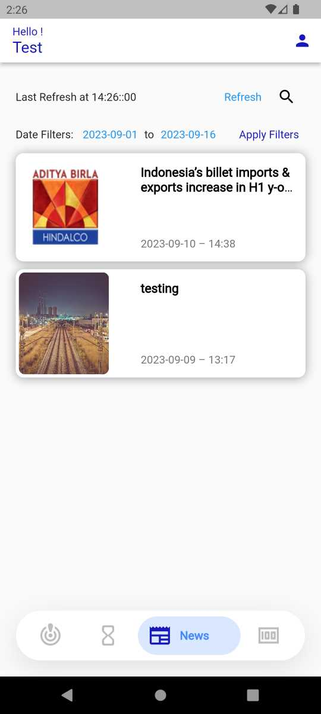
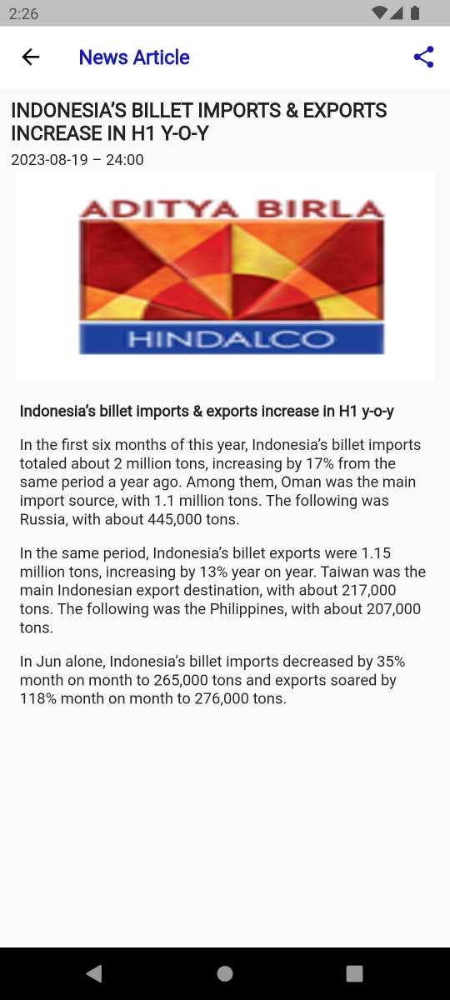
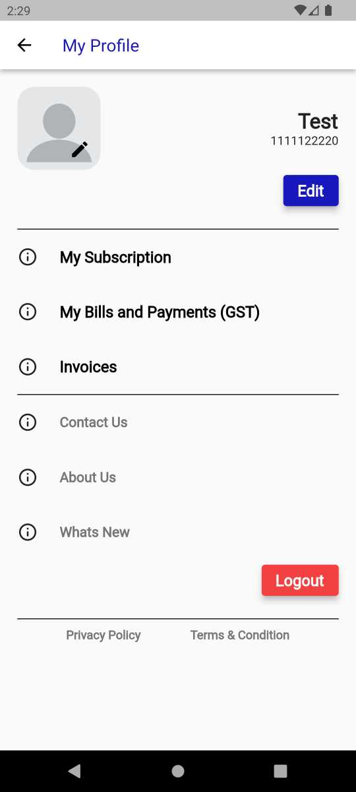
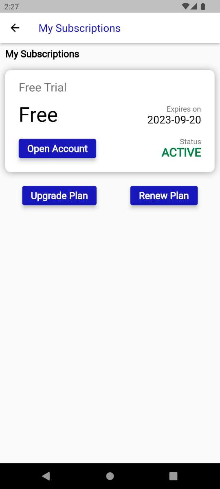
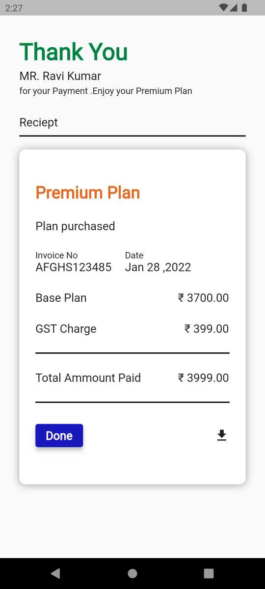
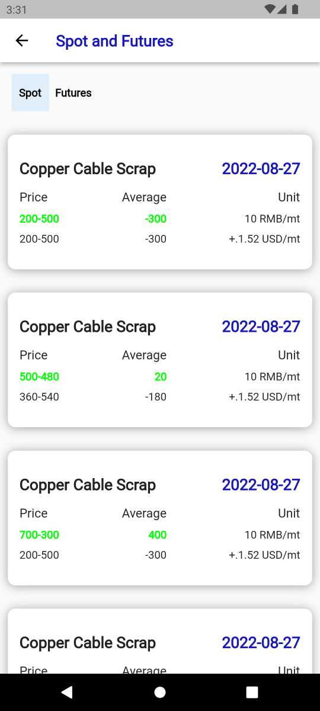
